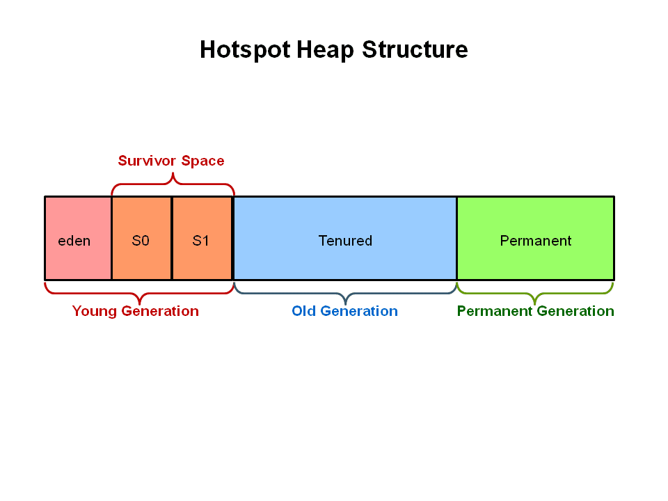
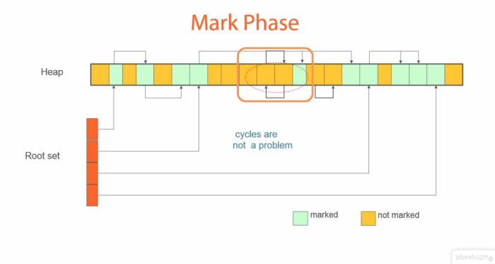
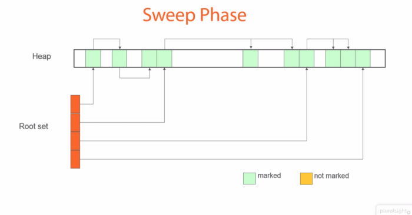
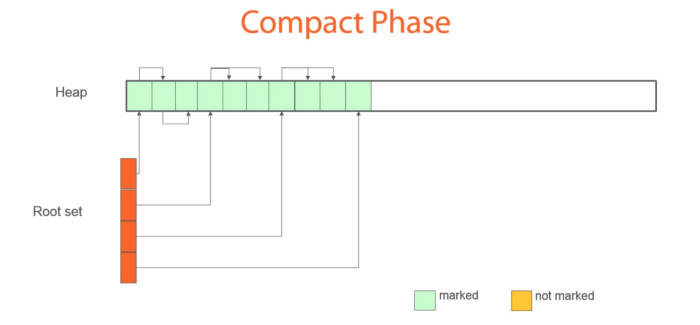

# Memory Management in Java

The Java memory model used internally in the JVM divides memory between thread stacks and heap.


## Thread Stack

Each thread running in the Java virtual machine has its own thread stack. **Stack** is the memory that is set aside for execution of a thread. When a method is called in a thread, that method is pushed on the stack as a `stack frame`.
The `stack frame` contains the local variables and references to objects (which are created in the heap) that are present in the method for which the `stack frame` was created. Once the execution of the method is complete, the `stack frame` is removed from the stack.

## Heap

When a Java program starts, the `OS` allots memory to the `JVM` for the application execution.

**Heap** is the dynamic memory that is allocated to a `JVM` process. This memory is used by the objects created during the application runtime and `JRE` classes.

The heap contains all objects created in the application regardless of which thread created the object.


A local variable may be of primitive type, in which case it is kept on the thread stack. A local variable may also be a reference to an object. In that case the reference (the local variable) is stored on the thread stack, but the object itself is stored on the heap.


The **Young Generation** memory space is where the new objects are created. Young generation is divided into two parts - **Eden Memory** and **Survivor Memory**.

When Eden space is filled, a **Minor GC** is performed and all the survivor objects are moved to one of the survivor spaces. Objects which survive many cycles of Minor GC, are moved to the **Old Generation** memory space.

**Old Generation** memory contains objects that are long-lived and have survived many iterations of a Minor GC.



## Permanent Generation

**Permanent Generation** or `PermGen` stores the application metadata required by the JVM. The metadata consists of *class and method definitions*, *static instances*, etc.

In `Java 8`, PermGen is replaced with **Metaspace**. They are very similar in their behavior, but the main difference is that **Metaspace** re-sizes dynamically.

## String Pool

> In computer science, string interning is a method of storing only one copy of each
> distinct string value, which must be immutable. Interning strings makes some string
> processing tasks more time- or space-efficient at the cost of requiring more time
> when the string is created or interned. The distinct values are stored in a string
> intern pool.

A `String` intern pool allows the runtime to save memory by preserving immutable strings in a pool so that common strings can be used instead of creating multiple instances of it.

When we use `"" (double quotes)` to declare a `String` variable, it first looks in the `String` pool if a String exists with the same value and returns the reference, else it creates a new one in the `String` pool.

```java
String greet = "Hello";
greet.concat(' World!')
System.out.println(greet);
```

Almost every method, applied to a `String` object in order to modify it, creates new `String` object.

When the compiler sees a `String` literal, it looks for the `String` in the pool. If a match is found, the reference to the new literal is directed to the existing String and no new `String` object is created. The existing `String` simply has one more reference.

In the String constant pool, a `String` object is likely to have one or many references. If several references point to same `String` without even knowing it, it would be bad if one of the references modified that String value. That's why String objects are **immutable**.

## Garbage Collection

**Garbage Collection** is a process which runs in the heap to clear out dead objects and free up memory space.

> The basic thing to understand with heap allocation is: the more memory you give it, the more time Java spends garbage collecting.

An object is eligible for garbage collection when it is not referred from any live thread or static reference. In other words, if all references for a given object points to `null` then it is eligible for garbage collection.

Since `Young Generation` keeps short-lived objects, `Minor GC` is very fast and the application does not get affected. However, during `Major GC` it takes a lot of time to check all the live objects in the `Old Generation`. It can make the application to become unresponsive and may cause timeout errors.

The duration taken by garbage collector depends on the strategy used for garbage collection. That’s why it’s necessary to monitor and tune the garbage collector to avoid timeouts in the highly responsive applications.

**How Garbage Collector Works**

Many people think garbage collection collects and discards dead objects. In reality, Java garbage collection is doing the opposite! Live objects are tracked and everything else designated garbage.

The heap, which is the area of memory used for dynamic allocation. In most configurations the operating system allocates the heap in advance to be managed by the JVM while the program is running. This has a couple of important ramifications:

- Object creation is faster because global synchronization with the operating system is not needed for every single object. An allocation simply claims some portion of a memory array and moves the offset pointer forward. The next allocation starts at this offset and claims the next portion of the array.
- When an object is no longer used, the garbage collector reclaims the underlying memory and reuses it for future object allocation. This means there is no explicit deletion and no memory is given back to the operating system.

All objects are allocated on the heap area managed by the JVM. Every item that the developer uses is treated this way, including class objects, static variables, and even the code itself. As long as an object is being referenced, the JVM considers it alive. Once an object is no longer referenced and therefore is not reachable by the application code, the garbage collector removes it and reclaims the unused memory.

**Garbage Collection Root - The Source of All Object Trees**

Every object tree must have one or more root objects. As long as the application can reach those roots, the whole tree is reachable. But when are those root objects considered reachable? Special objects called garbage-collection roots are always reachable and so is any object that has a garbage-collection root at its own root.

There are four kinds of GC roots in Java:

- **Local variables** are kept alive by the stack of a thread. This is not a real object virtual reference and thus is not visible. For all intents and purposes, local variables are GC roots.
- **Active Java threads** are always considered live objects and are therefore GC roots. This is especially important for thread local variables.
- **Static variables** are referenced by their classes. This fact makes them de facto GC roots. Classes themselves can be garbage-collected, which would remove all referenced static variables. This is of special importance when we use application servers, OSGi containers or class loaders in general.
- **JNI Reference** are Java objects that the native code has created as part of a JNI call. Objects thus created are treated specially because the JVM does not know if it is being referenced by the native code or not.

**Reference Counted Garbage Collection**

The reference count garbage collection keeps a track of the number of references for a particular object in the memory.

```java
Object a = new Object(); // Reference Count(OB1) starts at 1
Object b = a; // Reference Count (OB1) incremented to 2 as a new reference is added
Object c = new Object();

b.someMethod();
b = null; // Reference Count(OB1) decremented to 1 as reference goes away
a = c; // Reference Count(OB1) decremented to 0
```

> The main disadvantage in the reference counted garbage collection is its inability to identify circular references.

**Marking and Sweeping Away Garbage**

To determine which objects are no longer in use, the JVM intermittently runs what is very aptly called a mark-and-sweep algorithm.

- The algorithm traverses all object references, starting with the GC roots, and marks every object found as alive.
- All the heap memory that is not occupied by marked objects is reclaimed. It is simply marked as free, essentially swept free of unused objects.

During **mark phase**, the GC identifies the objects that are still in use and set their `mark bit` to true. The search starts with a root set of references kept in local variables in the stack or global variables. Starting from the root references the GC will conduct a depth search for the objects that have reachable references from the root. Any object that keeps a reference of another object, keeps that object alive.



During **sweep phase**, all the unmarked objects from the **mark phase** will be removed from the memory freeing up space.



After the sweep phase, all the memory locations are rearranged to provide a more compact memory allocation. The downside of this approach is an increased GC pause duration as it needs to copy all objects to a new place and to update all references to such objects.



Garbage collection is intended to remove the cause for classic memory leaks: unreachable-but-not-deleted objects in memory. However, this works only for memory leaks in the original sense. It's possible to have unused objects that are still reachable by an application because the developer simply forgot to dereference them. Such objects cannot be garbage-collected. Even worse, such a logical memory leak cannot be detected by any software. Even the best analysis software can only highlight suspicious objects.
